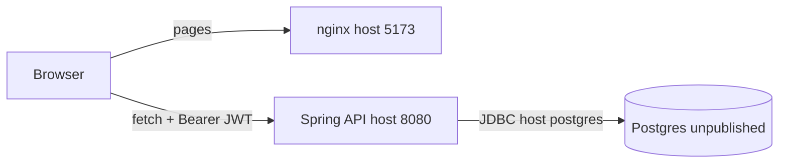
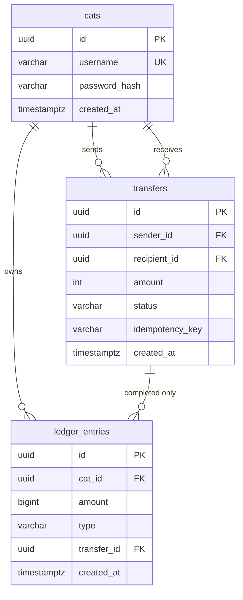

# Decisions

What we shipped, why it looks this way, and what we left out. How to run is in [README.md](../README.md). API shapes are in [backend/CONTRACT.md](backend/CONTRACT.md). Code maps are [backend/CODE.md](backend/CODE.md) and [frontend/CODE.md](frontend/CODE.md). Runtime and schema pictures are under [Shape of the system](#shape-of-the-system).

The product is one path: a signed-in cat sends treats to another cat, against a real API and Postgres. Extra time went into the ledger, idempotent sends, and backend tests — not into auth theater or UI chrome.

---

## What we built

- **Web:** register / log in, then a dashboard as *this* cat: balance, recipient picker, amount, confirm, success/failure, history. No sender picker.
- **API:** username + password, Bearer JWT, me / recipients / transfers / history.
- **Money:** Flyway schema, signed ledger rows, `FOR UPDATE` then `SUM`, idempotent `POST /api/transfers`.
- **Run:** one Compose command (Postgres + API + web). No `.env` copy. Demo cats `luna` / `milo` / `whiskers`.
- **Proof:** `MoneyPathTest` hits HTTP against a committed Postgres (happy path, reject replay, lock, fingerprint, history isolation).

---

## Shape of the system

The browser talks to two host ports. Compose wires the rest. Postgres is not on the host.

JWT lives in `localStorage`. Flyway `V1` runs when the API boots. `VITE_API_URL` is `http://localhost:8080` — the hostname `api` exists only on the Compose network, so the browser must not use it. CORS allows `http://localhost:5173` only.

Three tables. No balance column on `cats`. Balance is `COALESCE(SUM(ledger_entries.amount), 0)`.

- **Signup:** one `cats` row + one `SIGNUP_BONUS` `+100`. `transfer_id` is NULL. No `transfers` row.
- **COMPLETED:** one `transfers` row + debit **−N** and credit **+N** on the same `transfer_id`.
- **REJECTED:** one `transfers` row, zero ledger rows (sender history only).

Column CHECKs, the partial unique index, and the lock-then-SUM invariants are in Flyway [`V1__init.sql`](../backend/src/main/resources/db/migration/V1__init.sql) and the schema section of [backend/PLAN.md](backend/PLAN.md).

---

## Product

**Signup is the only funding event.** A new cat gets +100 as a `SIGNUP_BONUS` ledger credit — the same shape a later top-up would use, from a funding source instead of “signup.” We did not build a top-up screen or a rail. Reviewers can send immediately.

**The signed-in cat is always the sender.** The body is `{ recipientUsername, amount }`. Extra fields such as `senderUsername` are ignored. Picking both sides would be a demo harness, not a wallet.

**Treats are positive integers.** One currency, no FX, no fees. `10.5` is `VALIDATION`, not a float balance.

**Insufficient funds is a first-class outcome.** We persist `REJECTED` (no ledger movement), store the idempotency key, and return **409** the first time **and** on replay. The frontend treats 200/201 as paid, so a rejected replay must never be 200. Recipients do not see someone else’s failed send.

**Confirm before POST.** SCOPE asked for confirm. First click snapshots recipient + amount and disables those fields; Confirm sends that pair. A mis-click of 90 should not fire because the picker changed under the banner.

**History is useful, not a second app.** Who, amount, when, `COMPLETED` / `REJECTED`, IN / OUT. Newest first. On the send screen, not a separate route.

**Auth is only identity.** Username is the identifier (no email). Password + a 7-day JWT is enough to bind the sender across origins. No OAuth, magic links, reset, refresh tokens, or KYC.

---

## Money and concurrency

**Ledger is the source of truth.** There is no balance column on `cats`. Balance is `COALESCE(SUM(ledger_entries.amount), 0)`. Debit is **−N**, credit / signup is **+N**. `type` is metadata. Two `+N` rows would create money; the happy-path test (sender −N, recipient +N) is what would catch that.

**One transaction after validation.** `send()` is not `@Transactional`. An inner `TransactionTemplate` does: lock sender `FOR UPDATE` → idempotency lookup → SUM → `REJECTED` or `COMPLETED` + both ledger rows. Debit and credit commit together or not at all.

**SUM after the lock.** Computing the balance before `FOR UPDATE` is a race: two overlapping 80s from a 100-treat cat can both pass. The lock serializes senders. Proof is **that sender ends at 20** (one 201, one 409), not “global ledger SUM stayed flat” (two successful 80s still conserve the world total).

**Why not `SERIALIZABLE` only?** A row lock + post-lock SUM is enough, cheap to explain, and what the overlapping test asserts. Serializable would be a swap, not a better product.

**Why not catch unique violations inside `@Transactional`?** Spring marks the transaction rollback-only. The catch then 500s. The outer method is not transactional so the unique catch runs after the inner TX ends (same pattern on register).

**Idempotency key on the sender, not the world.** Unique `(sender_id, idempotency_key)`, column `NOT NULL`. Fingerprint is **recipient id + amount** (`Milo` ≡ `milo`). New user confirm = new UUID. Only a transport retry of that in-flight request reuses the key. Same key, different recipient or amount → `IDEMPOTENCY_CONFLICT`. Sticky reject on the same key is correct: that key means “this submit.”

**HTTP by stored outcome, not `replay=true`.** COMPLETED first **201**, COMPLETED replay **200**. Insufficient first and replay **409**. Mapping “any replay → 200” would teach the UI that a rejected retry was paid.

---

## API and security

**Errors are `{ "error", "message" }`.** The UI branches on `error`, not status alone. Uncaught exceptions are `INTERNAL` with no SQL in `message`. We do not log passwords or `Authorization`.

**`401` is two products.** Login/register: `"Wrong username or password."` (same text both ways). Protected route: `"Please sign in."` Treating a bad login as a dead session hides the form error (a snapshot bug we did not repeat).

**JWT:** HS256, `sub` = cat id (stable PK), TTL 7 days. The filter parses `sub`; it does not look up the cat row on every request. Demo signing key lives in `application.yml` so Compose needs no `.env`. Do not reuse it.

**CORS** is origin `http://localhost:5173` only (`127.0.0.1` is a different origin). Headers: `Authorization`, `Content-Type`, `Idempotency-Key`. `OPTIONS` is open. STATELESS, CSRF off.

**Jackson** `accept-float-as-int: false` so `10.5` cannot sneak in as 10. Unknown JSON fields are not fatal (so `senderUsername` cannot break the request).

**Usernames** are trimmed, then rejected if empty / `> 64`, then lowercased. Passwords empty / `> 72` characters → `VALIDATION` (BCrypt’s real limit is 72 bytes). Keys empty / `> 128` → `VALIDATION`.

---

## Frontend

**Vite + React + TypeScript, no Next.js.** The graded path is a static SPA talking to Spring. No SSR, no App Router.

**No React Router.** Token in `localStorage` (`meowpay.token`) picks auth vs dashboard.

**No Vite proxy.** Compose web and `npm run dev` both call `http://localhost:8080` from the browser. A proxy would hide a CORS mistake the reviewer will hit.

**`VITE_API_URL` is a browser URL**, baked into the nginx image as `http://localhost:8080`. Never `http://api:8080` (that hostname only exists on the Compose network).

**`fetch` only.** TypeError retry lives **inside `sendTreats`**, same key. Retrying register after a dropped 201 yields `USERNAME_TAKEN` and no stored token.

**In-flight is a ref.** `setBusy(true)` paints too late; two clicks mint two keys. Same guard on register. After 200/201 we unmount Confirm **before** clearing the ref. Send and refetch are separate tries so a failed `/api/me` cannot look like a failed send.

**Dashboard, not a phone column on a desktop.** Auth is a narrow card. Signed-in: header + cards, two columns from 640px, stacked below. Cream / ginger, one stylesheet, no UI kit, no dark mode, no mascot. Nunito with a system sans fallback.

**JWT in `localStorage`.** Fine for a takehome; not httpOnly. Protected 401 clears it.

---

## Run and tests

**Compose is the run story.** Postgres (unpublished 5432, named volume `postgres_data`) + API 8080 + web 5173. `down` keeps the ledger; `down -v` wipes it. Reviewer needs Docker, not a JDK/Node toolchain. Datasource URL is injected; we never default to `localhost:5432` so host Maven cannot silently talk to a published DB.

**Web image:** `node:22-alpine`, lockfile + `npm ci`, `nginx:1.27-alpine`, `nginx.conf` on `/etc/nginx/conf.d/default.conf`, `wget` healthcheck so `--wait` waits for port 80.

**Tests are HTTP against a committed DB.** No class-level `@Transactional` on the lock case (that would hide the race). Testcontainers if the Java Docker client works; otherwise Docker CLI (`CliPostgres`). Surefire `*Test`. Compose is not the test database.

**No frontend test suite.** SCOPE: backend covers the money. Manual path is the README.

---

## Stack choices

| Choice | Why | Instead of |
| --- | --- | --- |
| Java 21 / Spring Boot / Maven | Their stack family; we ship faster in Java | Kotlin, Gradle |
| Postgres + Flyway | Real ACID ledger; schema in git | `ddl-auto`, SQLite |
| jjwt HS256 | Enough to bind a sender | Sessions, cookies, Supabase Auth |
| Vite + React 19 | Web app as scoped | Next.js, Flutter |
| Docker Compose | One command from a clean clone | “install JDK and Node and copy `.env`” |

---

## What we did not do

| Left out | Why |
| --- | --- |
| **Funding rail / top-up UI** | Signup *is* the funding event. Same credit later; different source. |
| **Refresh tokens, email, OAuth, password reset** | Auth is not the showcase. A 7-day JWT binds the sender. |
| **httpOnly cookie session** | Cross-origin Compose/Vercel vs API is simpler with Bearer + `localStorage`. Documented as a skip. |
| **Hosted deploy (Vercel / Render / Supabase)** | Clone + Compose is what they grade. Parked until a human asks. |
| **Kotlin** | Faster for us; their ramp bonus left on the table. |
| **Flutter / native mobile** | The brief wants a web app. The dashboard is responsive; it is not an app store build. |
| **Sender picker** | Impersonation is not a product. |
| **Cached balance column** | SUM after lock is enough and harder to desync. |
| **Frontend tests (Cypress / Playwright / Vitest)** | Extra time goes to ledger tests. |
| **Locking paper / SERIALIZABLE write-up** | The lock is in the code and the overlapping test. |
| **FX, fees, multi-currency, chargebacks** | One treat currency. |
| **Notifications, websockets, admin** | Refetch after send is enough. |
| **Design system / dark mode / mascot** | Clear beats pretty-and-empty. |
| **Vite proxy / `VITE_API_URL=http://api:8080`** | Would work in Docker and fail in the browser. |
| **Publishing Postgres 5432** | API runs via Compose only. Host `mvn spring-boot:run` is out. |

---

## How we worked

A **builder** wrote the plans, then implemented one approved step at a time. A **critic** reviewed the plan and the money path in a separate pass (lock-before-SUM, replay HTTP, CORS / `Idempotency-Key` preflight, confirm snapshot, tests on a committed DB). The decisions above are ours to defend.
