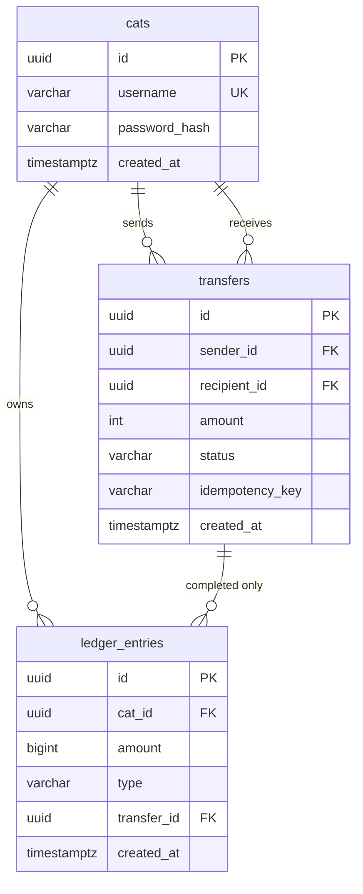
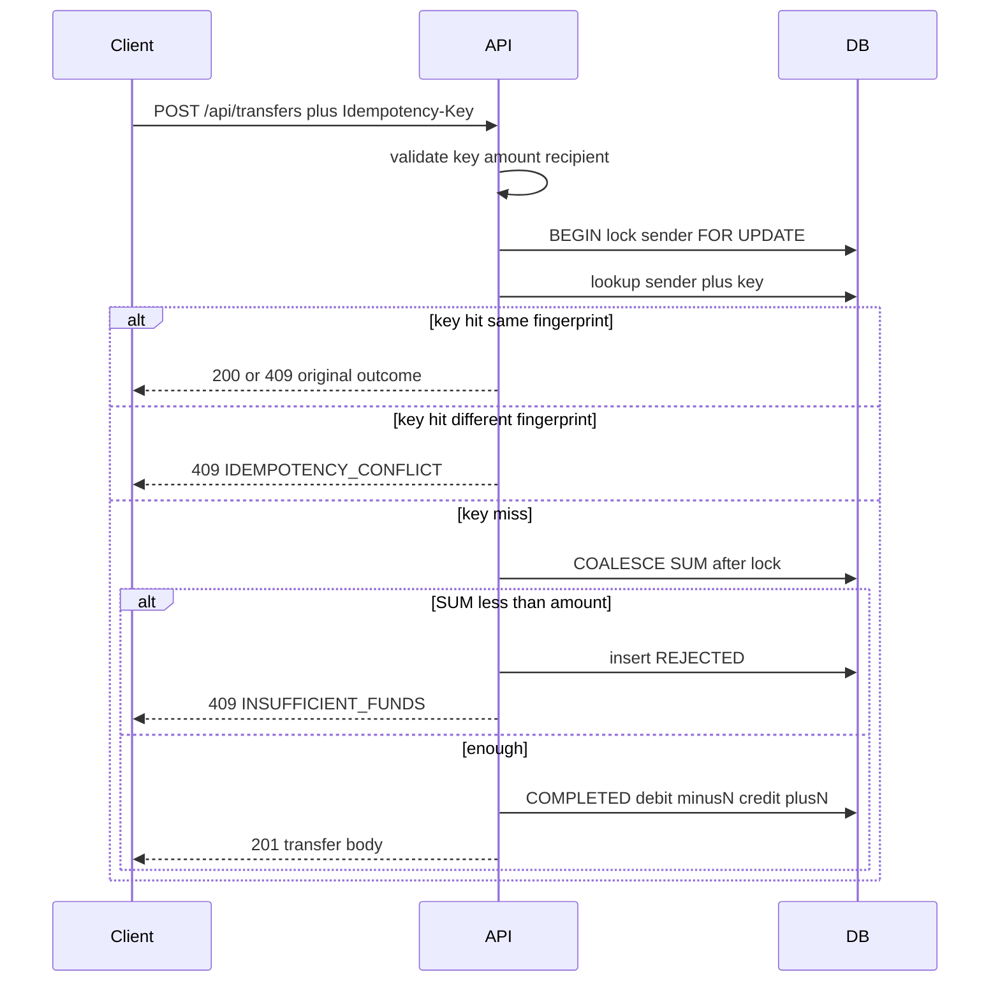

# Backend-only implementation plan (critic review)

**Status:** implementing one approved step at a time. README is how-to-run only (later). Code notes go in [CODE.md](CODE.md). The human decides when to commit.

## Backend steps

- [x] 0 — Repo hygiene (gitignore, this checklist, CODE.md stub)
- [x] 1 — Spring Boot skeleton + `/api/health`
- [x] 2 — Compose Postgres + API (no host 5432)
- [x] 3 — Security, CORS, JWT, error envelope
- [x] 4 — Flyway schema + JPA
- [x] 5 — Register + signup bonus
- [x] 6 — Login
- [x] 7 — Seed luna / milo / whiskers
- [x] 8 — `GET /api/me` and `/api/recipients`
- [x] 9 — `POST /api/transfers`
- [x] 10 — `GET /api/me/transfers`
- [x] 11 — `MoneyPathTest`
- [x] 12 — README how-to-run

**Review this file** with `@critic`. Product rules (API shapes, replay table, lock-then-SUM) stay in [PLAN.md](../../PLAN.md). This file is the **build script** plus the **authoritative DB schema**.

**In this pass:** `backend/` + root Compose (Postgres + API only) + docs. **Not in this pass:** `web/`, Vercel/Render/Supabase.

**How we work:** implement **one approved step at a time**. Update [CODE.md](CODE.md) in the same step. Do not update README incrementally. Do not commit unless the human asks.

**Reference (do not copy blindly):** `/Users/abubakar/Downloads/meow-pay-implemented` is an earlier snapshot. Rebuild clean; use it only if a detail is unclear.

**Lesson from the first build (lock these in):**

- Surefire runs `*Test.java`, not `*IT.java`.
- Jackson defaults `ACCEPT_FLOAT_AS_INT=true` — set it **false** or `10.5` becomes `10` and 201s.
- Do **not** set `FAIL_ON_UNKNOWN_PROPERTIES` (leave default false). Step 9 must ignore `senderUsername`.
- jjwt may pick HS384 if the key is long — force **HS256**.
- Testcontainers’ Java client can 400 on Docker Engine 29. Prefer **Testcontainers first**; if it cannot see Docker, start Postgres via the **Docker CLI** in the test (same assertions). Do not silently skip the overlapping-send test.
- Do **not** publish Postgres `5432` on the host. Run the API **only via Compose**. Do not add `5432:5432` to “make `mvn spring-boot:run` work.”
- Unique-constraint races (register **and** transfer): **outer method is not `@Transactional`**. Inner TX does the work. Catch `DataIntegrityViolationException` **after** that TX has ended (`TransactionTemplate` or a second bean). Catching inside `@Transactional` marks the TX rollback-only → 500.
- Overlapping 80+80 proves the lock only if you assert **one 201 + one 409** and **sender balance = 20**. Global `SUM(all ledger)` stays 200 even if both succeed (luna −60, milo 260). That is a signup-bug check, not a lock check.
- Money tests talk HTTP (`TestRestTemplate` / `MockMvc`) against a **committed** DB. No class-level `@Transactional` / `@Rollback` on the overlapping case (or on “still 100 after restart”).
- CORS is a **global** `CorsConfigurationSource` in the security chain, not `@CrossOrigin` on a controller that does not exist yet.
- `eclipse-temurin:21-jre` does **not** ship `curl`. Install it (or healthcheck with `wget`). `start_period` 40–60s plus retries.
- BCrypt only uses 72 bytes. Reject password length `> 72` as `VALIDATION`. Reject username `> 64` and idempotency key `> 128` as `VALIDATION` (do not let Postgres 500).
- Uncaught exceptions → `{ "error": "INTERNAL", "message": "..." }` with **no** Hibernate/SQL text. Never log `password` or `Authorization`.
- Map transfer HTTP status **by outcome**, never by a `replay` boolean: `COMPLETED` first → **201**; `COMPLETED` replay → **200**; `INSUFFICIENT_FUNDS` first **and** replay → **409**; fingerprint mismatch → **409** `IDEMPOTENCY_CONFLICT`. `replay=true` → 200 would turn a REJECTED retry into a fake success (FE treats 200/201 as paid).
- Hikari/Flyway need a DB role. Compose must set **username and password** (`meowpay` / `meowpay`, demo role). Flyway **off** until V1 exists (or land `db/migration/` so the location resolves). Tests inject url/user/password via `@DynamicPropertySource` — `mvn test` does not use Compose.

---

## Critic pass (backend steps + schema) — builder response

| # | Verdict | What changed |
| --- | --- | --- |
| 1 | **Fixed** | Step 5 proves the bonus with **SQL**. `GET /api/me` stays Step 8. |
| 2 | **Fixed** | Overlapping test: one 201 + one 409 and **luna = 20**. Global SUM is not the lock assertion. |
| 3 | **Fixed** | Step 9 repeats the register pattern: outer method not `@Transactional`; unique catch after the inner TX ends. |
| 4 | **Fixed** | Step 11: HTTP against a committed DB; no class-level `@Transactional` on the overlapping case. |
| 5 | **Fixed** | Step 8: never self, never `passwordHash`, includes milo + whiskers. “Exactly two” only after `down -v`. Empty-ledger 0 is Step 11. |
| 6 | **Fixed** | Step 3: global `CorsConfigurationSource` so OPTIONS `/api/transfers` works with no transfer controller. |
| 7 | **Fixed** | Step 2: install curl (or wget) in the JRE image; `start_period` 40–60s + retries. |
| 8 | **Fixed** | No host `localhost:5432` default. API runs via Compose only. Do not publish 5432. |
| 9 | **Fixed** | After trim: username empty or > 64, key empty or > 128, password empty or > 72 → `VALIDATION`. Trim username before the blank check. |
| 10 | **Fixed** | `UNIQUE (transfer_id, type)` where `transfer_id IS NOT NULL`. Do not set `FAIL_ON_UNKNOWN_PROPERTIES`. |
| Nit diagram | **Fixed** | Sequence includes hit + different fingerprint → 409 `IDEMPOTENCY_CONFLICT`. |
| Nit same-key parallel | **Fixed** | Step 11 has an explicit same-key parallel / unique-violation case. |
| Nit 5xx | **Fixed** | Uncaught → `INTERNAL`, no SQL/Hibernate in `message`. |
| Nit logs | **Fixed** | Do not log password or `Authorization`. |
| Nit sender index | **Fixed** | Dropped redundant `idx_transfers_sender_id`. |
| C-1 | **Fixed** | Controller maps by **outcome**: COMPLETED 201/200; INSUFFICIENT first and replay **409**; conflict 409. Never `replay=true` → 200. |
| C-2 | **Fixed** | Step 2 sets datasource user/password. Flyway disabled until Step 4 (or empty `db/migration/` so the location exists). |
| C-3 | **Fixed** | Overlap curl uses **overlapcat** (100 treats). No `down -v` mid-script. Explicit Luna→whiskers before Step 10. |
| C-4 | **Fixed** | Step 11 injects url/user/password (`@DynamicPropertySource` / test yml). Compose is not assumed. |
| C-5 | **Fixed** | Empty-ledger cat: known BCrypt + login, or mint JWT `sub` = that id. Not “SQL then GET”. |
| C-6 | **Fixed** | Dropped unknown-URL → INTERNAL. 404 is not that hook. |
| C-7 | **Fixed** | Step 11 has two-thread parallel register (outer unique-catch), not only sequential 409. |
| Nit Step 6 passwords | **Fixed** | 73-char reject is Step 5 only. Step 6 does not re-run that reminder as a command. |
| Nit BCrypt bytes | **Won’t fix** | API rule stays “72 characters.” Fine for this takehome. |

---

## Database schema (Flyway `V1__init.sql`)

One database: Postgres. No `ddl-auto`. No balance column on `cats`. Application assigns UUIDs (or `gen_random_uuid()`). All timestamps `TIMESTAMPTZ` / Java `Instant` UTC.



### `cats`

- `id` UUID PK
- `username` VARCHAR(64) NOT NULL UNIQUE — stored **already lowercase**; unique is on that value
- `password_hash` VARCHAR(255) NOT NULL — BCrypt only, never plaintext
- `created_at` TIMESTAMPTZ NOT NULL DEFAULT NOW()
- **No** `balance` column (source of truth is the ledger)

Lock for transfers: `SELECT … FROM cats WHERE id = :senderId FOR UPDATE`.

### `transfers`

- `id` UUID PK
- `sender_id` UUID NOT NULL REFERENCES `cats(id)`
- `recipient_id` UUID NOT NULL REFERENCES `cats(id)`
- `amount` INTEGER NOT NULL CHECK (`amount > 0`) — positive integer treats, not signed
- `status` VARCHAR(20) NOT NULL CHECK (`status IN ('COMPLETED', 'REJECTED')`)
- `idempotency_key` VARCHAR(128) NOT NULL
- `created_at` TIMESTAMPTZ NOT NULL DEFAULT NOW()
- UNIQUE (`sender_id`, `idempotency_key`) — `NOT NULL` so two blank keys cannot bypass uniqueness (Postgres UNIQUE allows multiple NULLs)
- FKs ON DELETE RESTRICT (default). Do not CASCADE delete money.

Indexes: PK; unique (sender, key); `idx_transfers_recipient_id` (history). Do **not** add `idx_transfers_sender_id` — it is redundant with `UNIQUE (sender_id, idempotency_key)`.

App rejects missing/blank/over-long keys with 400 **before** insert. Empty string would satisfy NOT NULL and collide on unique — still 400 in the API.

### `ledger_entries`

- `id` UUID PK
- `cat_id` UUID NOT NULL REFERENCES `cats(id)`
- `amount` BIGINT NOT NULL — **signed**. Debit **−N**, credit / signup **+N**. `type` is metadata only; two `+N` rows create money
- `type` VARCHAR(32) NOT NULL CHECK (`type IN ('SIGNUP_BONUS', 'TRANSFER_DEBIT', 'TRANSFER_CREDIT')`)
- `transfer_id` UUID NULL REFERENCES `transfers(id)` — NULL only for `SIGNUP_BONUS`
- `created_at` TIMESTAMPTZ NOT NULL DEFAULT NOW()

CHECKs (land in V1):

- `amount <> 0`
- `(type = 'SIGNUP_BONUS' AND transfer_id IS NULL) OR (type IN ('TRANSFER_DEBIT', 'TRANSFER_CREDIT') AND transfer_id IS NOT NULL)`
- `(type = 'TRANSFER_DEBIT' AND amount < 0) OR (type IN ('SIGNUP_BONUS', 'TRANSFER_CREDIT') AND amount > 0)`

**One debit and one credit per completed transfer:** `UNIQUE (transfer_id, type)` where `transfer_id IS NOT NULL` (partial unique index). Stops a retry bug from inserting a second `TRANSFER_CREDIT`. Multiple `SIGNUP_BONUS` rows stay allowed (`transfer_id` is NULL).

Index: `idx_ledger_entries_cat_id` (SUM and tests).

### Invariants the schema + app must keep

- Balance of a cat = `COALESCE(SUM(ledger_entries.amount), 0)` for that `cat_id`. Empty set is 0, never SQL NULL / Java NPE.
- Register: one `cats` row + one `SIGNUP_BONUS` `+100`. No `transfers` row.
- `COMPLETED` transfer: one `transfers` row + exactly two ledger rows (`TRANSFER_DEBIT` −N on sender, `TRANSFER_CREDIT` +N on recipient), same `transfer_id`, same N as `transfers.amount`. The partial unique index enforces at most one row per `(transfer_id, type)`.
- `REJECTED` transfer: one `transfers` row, **zero** ledger rows.
- Seed: three `cats` + three `SIGNUP_BONUS` +100. No seed transfers.
- Total treats in the system = 100 × number of cats (until we add another credit type). Use that as a **signup / double-credit** check. It does **not** prove the transfer lock: two successful 80s from a 100-treat sender still leave the global sum unchanged (luna −60, milo 260, total 200). The lock proof is **sender balance = 20**, not a flat global SUM.

### Intended V1 SQL (authoritative for Step 4)

```sql
CREATE TABLE cats (
    id UUID PRIMARY KEY,
    username VARCHAR(64) NOT NULL UNIQUE,
    password_hash VARCHAR(255) NOT NULL,
    created_at TIMESTAMPTZ NOT NULL DEFAULT NOW()
);

CREATE TABLE transfers (
    id UUID PRIMARY KEY,
    sender_id UUID NOT NULL REFERENCES cats (id),
    recipient_id UUID NOT NULL REFERENCES cats (id),
    amount INTEGER NOT NULL CHECK (amount > 0),
    status VARCHAR(20) NOT NULL CHECK (status IN ('COMPLETED', 'REJECTED')),
    idempotency_key VARCHAR(128) NOT NULL,
    created_at TIMESTAMPTZ NOT NULL DEFAULT NOW(),
    UNIQUE (sender_id, idempotency_key)
);

CREATE TABLE ledger_entries (
    id UUID PRIMARY KEY,
    cat_id UUID NOT NULL REFERENCES cats (id),
    amount BIGINT NOT NULL CHECK (amount <> 0),
    type VARCHAR(32) NOT NULL CHECK (type IN ('SIGNUP_BONUS', 'TRANSFER_DEBIT', 'TRANSFER_CREDIT')),
    transfer_id UUID REFERENCES transfers (id),
    created_at TIMESTAMPTZ NOT NULL DEFAULT NOW(),
    CHECK (
        (type = 'SIGNUP_BONUS' AND transfer_id IS NULL)
        OR (type IN ('TRANSFER_DEBIT', 'TRANSFER_CREDIT') AND transfer_id IS NOT NULL)
    ),
    CHECK (
        (type = 'TRANSFER_DEBIT' AND amount < 0)
        OR (type IN ('SIGNUP_BONUS', 'TRANSFER_CREDIT') AND amount > 0)
    )
);

CREATE INDEX idx_ledger_entries_cat_id ON ledger_entries (cat_id);
CREATE INDEX idx_transfers_recipient_id ON transfers (recipient_id);
CREATE UNIQUE INDEX idx_ledger_entries_one_type_per_transfer
    ON ledger_entries (transfer_id, type)
    WHERE transfer_id IS NOT NULL;
```

---

## Locked contract (do not reopen)

Copy these into code and tests. Full JSON shapes stay in [PLAN.md](../../PLAN.md).

**Transfer order (one DB transaction after request validation):** lock sender `FOR UPDATE` → idempotency lookup → `COALESCE(SUM(amount), 0)` → `REJECTED` (no ledger) or `COMPLETED` (debit **−N**, credit **+N**).

**Transfer TX shape (same as register):** a **non-`@Transactional` outer** method. Inner TX (self-invocation-safe: `TransactionTemplate` or a second bean): lock → lookup → SUM → insert. On unique violation, the inner TX is already over; then `SELECT` by `(sender_id, key)` and return replay, or retry the use-case **once**. Never catch `DataIntegrityViolationException` inside the inner `@Transactional`.

**HTTP status (map by stored outcome, not a `replay` flag):**

- `COMPLETED` first → **201** + two ledger rows.
- `COMPLETED` replay (same key + same fingerprint) → **200**, no second movement.
- `INSUFFICIENT_FUNDS` first → store `REJECTED` + key, **409**.
- `INSUFFICIENT_FUNDS` replay → **409** again, **never 200** (FE treats 200/201 as success).

**Replay**

- `VALIDATION` / `SAME_CAT` / `NOT_FOUND`: no row, no key, re-evaluate.
- Fingerprint mismatch on a stored key → **409** `IDEMPOTENCY_CONFLICT`.
- Fingerprint is **recipient id + amount**, not the raw username (`Milo` ≡ `milo`).
- New user submit = new key. Sticky reject on the same key is correct.

**Security:** `STATELESS`, CSRF off, jjwt HS256, `sub` = cat id, TTL 7 days. `OPTIONS` and `/api/auth/**` and `/api/health` permitAll. CORS via a **global** `CorsConfigurationSource`: origin `http://localhost:5173` only; headers `Authorization`, `Content-Type`, `Idempotency-Key`. OPTIONS before JWT filter.

**Errors:** `{ "error": "<CODE>", "message": "..." }`. `@ControllerAdvice` maps bind / `HttpMessageNotReadableException` to `VALIDATION` (tests assert the **code**, not only 400). Uncaught → `INTERNAL`; `message` must not contain Hibernate/SQL. Do not log password or `Authorization`.

**Validation (after trim, before insert):** username empty or `> 64` → `VALIDATION`. Password empty or `> 72` **characters** → `VALIDATION` (API rule; BCrypt’s real limit is 72 bytes). Idempotency-Key empty or `> 128` → `VALIDATION`. Trim username **before** the blank check (`" "` must not become `""` in the table).

**Usernames:** trim + lowercase on register, login, and `recipientUsername`. Parallel register of the same name → 409 `USERNAME_TAKEN`, not 500 (outer catch).

**History:** `COMPLETED` sent = OUT; `COMPLETED` received = IN; `REJECTED` = sender only. Recipients never see a failed inbound. DTOs only — no `password` / `passwordHash` on JSON.



---

## Docs habit (every step)

**Do not** update [README.md](../../README.md) after each step. README stays a short **how to run** (Compose, ports, demo cats) and is written once near the end (Step 12), not incrementally.

**Do not** commit after each step. The human decides when to commit.

In the **same** step as the code:

1. Update [docs/backend/CODE.md](CODE.md) — what the new code is, why it exists, how the pieces connect. This is the “explain the code” doc, not the runbook.
2. Tick the step in the checklist at the top of this file.
3. After statuses exist in the API, fix [SCOPE.md](../../SCOPE.md) polish #1: transfer states are **must-ship**, not optional. Do that in the send/history step, not sooner.

Do not put product code under `docs/agents/` or `.cursor/`.

---

## How we implement

1. Builder explains the next step (files, why, how you’ll try it).
2. Human approves that step.
3. Builder implements **only** that step. Stop. Explain the next one.

---

## Step 0 — Repo hygiene + checklist (docs only)

**Build:** Expand [.gitignore](../../.gitignore) for `backend/target/`, `.idea/`, `.env` / `.env.*` (keep `!.env.example` if we add it later). Add a **Backend steps** checklist to the top of **this** file (steps 0–12). Create [docs/backend/CODE.md](CODE.md) as a stub (“what the API code is; filled in as steps land”).

**Test:** `.gitignore` covers `backend/target/` and `.env*`. Checklist and CODE.md stub exist.

**Docs:** CODE.md stub only. **Do not** change README. **Do not** commit.

---

## Step 1 — Empty Spring Boot that boots

**Build:** [backend/pom.xml](../../backend/pom.xml) — Spring Boot **3.4.x**, Java 21, Maven. Starters: `web`, `data-jpa`, `security`, `validation`, `postgresql`, `flyway-core`, `flyway-database-postgresql`. Exclude `UserDetailsServiceAutoConfiguration` so Boot does not create a default user. [backend/src/main/java/com/meowpay/MeowPayApplication.java](../../backend/src/main/java/com/meowpay/MeowPayApplication.java). [backend/src/main/resources/application.yml](../../backend/src/main/resources/application.yml): `ddl-auto: none`, port **8080**. Datasource **username/password default to `meowpay` / `meowpay`** (demo DB role, not a product secret). URL comes from **`SPRING_DATASOURCE_URL`** (Compose sets it in Step 2). **Do not** default the URL to `localhost:5432`. **`spring.flyway.enabled: false`** until Step 4 (V1 does not exist yet). If Flyway is left on, also land an empty [backend/src/main/resources/db/migration/](../../backend/src/main/resources/db/migration/) so `classpath:db/migration` resolves — prefer disabled.

Add `HealthController` → `GET /api/health` → `{ "status": "up" }`.

Temporary Security: permitAll everything **only if** we cannot boot otherwise; replace in step 3. Prefer step 3 security in the same week so we do not leave an open API overnight.

**Test:** `cd backend && mvn -q -DskipTests package`. Do **not** run the API on the host. Wait for Compose in Step 2.

**Docs:** CODE.md: skeleton, health route, Flyway off, why there is no `localhost:5432` URL. **Do not** change README. **Do not** commit.

---

## Step 2 — Compose Postgres + API (no web, no 5432 publish)

**Build:** Root [docker-compose.yml](../../docker-compose.yml):

- `postgres`: `postgres:16-alpine`, db/user/password `meowpay`, **healthcheck** `pg_isready -U meowpay -d meowpay`. **No** `ports: 5432`.
- `api`: build [backend/Dockerfile](../../backend/Dockerfile). Base JRE image does **not** include curl — `apt-get install curl` (Debian/Ubuntu JRE) or `apk add curl` (Alpine), or healthcheck with `wget`. Env **must** include all three: `SPRING_DATASOURCE_URL=jdbc:postgresql://postgres:5432/meowpay`, `SPRING_DATASOURCE_USERNAME=meowpay`, `SPRING_DATASOURCE_PASSWORD=meowpay` (same demo role the image creates). URL alone is not enough. `depends_on: postgres: condition: service_healthy`. Publish **8080:8080**. API HEALTHCHECK: `curl -fsS http://127.0.0.1:8080/api/health` (or wget equivalent). **`start_period`: 40–60s**, interval ~5s, **retries** ≥ 10. First Spring boot often exceeds 20s. Flyway stays **off** until Step 4 so missing `db/migration` cannot fail the boot.
- Demo JWT default in `application.yml` (long enough for HS256, obvious “not for prod”). No `.env` required.

CORS + security can still be stubbed if step 3 is next; health must be permitAll.

**Test:** `docker compose up --build --wait`. Container becomes healthy (Hikari connects as `meowpay`, Flyway does not look for V1). `curl -fsS http://localhost:8080/api/health`. Second `up` after `down` still works. Confirm **nothing** listens on host 5432 from this Compose file.

**Docs:** README: `docker compose up --build --wait`; first boot can take ~60s; API at `http://localhost:8080`. **Run the API only via Compose.** Do not publish 5432 so host Maven can reach Postgres. JWT default is demo-only.

**Commit:** `Run API and Postgres from Compose with healthchecks.`

---

## Step 3 — Security, CORS, JWT, error envelope (no money yet)

**Build:**

- `SessionCreationPolicy.STATELESS`, CSRF off, formLogin/httpBasic off.
- permitAll: `OPTIONS /**`, `/api/auth/**`, `/api/health`. Everything else authenticated.
- CORS: a **global** `CorsConfigurationSource` (or equivalent) registered in the **security filter chain**, not `@CrossOrigin` on controllers. Origin `http://localhost:5173` only; methods GET, POST, OPTIONS; headers `Authorization`, `Content-Type`, `Idempotency-Key`. OPTIONS before JWT filter. Preflight on `/api/transfers` must work **before** that mapping exists.
- `JwtService` (jjwt): issue/parse, **explicit HS256**, expiry 7d, `sub` = UUID string. 401 entry point returns `{ "error": "UNAUTHORIZED", "message": "..." }`.
- `GlobalExceptionHandler`: `ApiException` + bind + `HttpMessageNotReadableException` + missing header → `{ error, message }`. Uncaught `Exception` → `{ "error": "INTERNAL", "message": "..." }` with **no** Hibernate/SQL text. Do not log request bodies that contain `password`, and do not log `Authorization`.
- `spring.jackson.deserialization.accept-float-as-int: false`. Do **not** set `FAIL_ON_UNKNOWN_PROPERTIES`.
- Hibernate JDBC timezone UTC; `createdAt` is `Instant`.
- Land empty auth controllers (or a dummy POST) so bad JSON maps to `VALIDATION` rather than 404.

**Test:**

- `curl -X OPTIONS http://localhost:8080/api/transfers -H 'Origin: http://localhost:5173' -H 'Access-Control-Request-Method: POST' -H 'Access-Control-Request-Headers: Authorization,Idempotency-Key,Content-Type'` → 200, allow-origin and both headers listed. **No 401.** Not 404 without CORS headers.
- `curl http://localhost:8080/api/me` → 401 + `error: UNAUTHORIZED`.
- `curl -X POST http://localhost:8080/api/auth/login -H 'Content-Type: application/json' -d '{'` → 400 + `error: VALIDATION`.

**Docs:** README: CORS origin is `localhost:5173` not `127.0.0.1`; errors are `{ error, message }`; 5xx use `INTERNAL` without SQL.

**Commit:** `Add stateless JWT security, CORS, and error envelope.`

---

## Step 4 — Schema (Flyway only)

**Build:** Set `spring.flyway.enabled: true`. Land the **intended V1 SQL** from the Database schema section in [backend/src/main/resources/db/migration/V1__init.sql](../../backend/src/main/resources/db/migration/V1__init.sql). JPA entities match 1:1 (no extra columns). Repositories: `CatRepository.lockById` with `@Lock(PESSIMISTIC_WRITE)`; `LedgerEntryRepository.sumBalance` = `coalesce(sum(e.amount), 0)`.

**Test:** `docker compose up --wait`, then `docker compose exec postgres psql -U meowpay -d meowpay -c '\dt'` shows three tables. `\d transfers` shows UNIQUE (sender_id, idempotency_key) and NOT NULL key. `\d ledger_entries` shows the partial unique index on `(transfer_id, type)`. Restart API: Flyway no-ops. `SELECT COALESCE(SUM(amount),0) FROM ledger_entries` → `0`. Insert a debit with `amount > 0` or a signup with `transfer_id` set — Postgres CHECK must reject. Two `TRANSFER_CREDIT` rows with the same `transfer_id` — unique index must reject.

**Docs:** PLAN checklist: schema done. README: money is ledger rows; debit is negative.

**Commit:** `Add Flyway ledger schema and JPA mappings.`

---

## Step 5 — Register + signup bonus

**Build:** `POST /api/auth/register` `{ username, password }` → **201** `{ token, username }`.

- Normalize username: trim **first**, then reject empty or `> 64`, then lowercase. Password empty or `> 72` characters → 400 `VALIDATION`. `" "` must not insert a blank username.
- One transaction: insert cat (BCrypt hash) + ledger `SIGNUP_BONUS` **+100**.
- Exists or unique violation → 409 `USERNAME_TAKEN`. **Outer method is not `@Transactional`**; catch unique violation **after** the inner TX ends (same pattern as transfers). Not 500.
- JWT `sub` = new cat id. Response username is normalized (`Olive` → `olive`).
- DTOs only. Do not log the password.

**Do not** implement `GET /api/me` in this step. That is Step 8.

**Test (curl + SQL against Compose):**

- Register `Olive` / `treats123` → 201, username `olive`.
- Prove the bonus with SQL, not HTTP: `docker compose exec postgres psql … -c "SELECT c.username, COALESCE(SUM(l.amount),0) FROM cats c LEFT JOIN ledger_entries l ON l.cat_id = c.id WHERE c.username = 'olive' GROUP BY c.username"` → `olive | 100`.
- Register `olive` or `OLIVE` again → 409 `USERNAME_TAKEN`.
- Register `{"username":"","password":"x"}` and `{"username":"   ","password":"x"}` → 400 `VALIDATION`.
- Username 65 chars or password 73 chars → 400 `VALIDATION` (not 500).
- Two parallel registers of `samecat` (two curls / two threads) → one 201, one 409, not 500.
- Restart API: SQL still shows olive 100 (persistence). Do not call `GET /api/me` (404 until Step 8).

**Docs:** README: register credits 100 as a ledger row; usernames are case-insensitive; password max 72.

**Commit:** `Register cats with a 100-treat signup ledger credit.`

---

## Step 6 — Login

**Build:** `POST /api/auth/login` same body → **200** `{ token, username }`. Normalize username (trim + lowercase). Wrong password / unknown user → 401 `UNAUTHORIZED` (same message, no user enumeration). Blank, username `> 64`, or password `> 72` → 400 `VALIDATION`. Do not log password or `Authorization`.

**Test:** Login `OLIVE` / `treats123` works. Bad password → 401 + `UNAUTHORIZED`. New JWT `sub` is the same cat id (decode payload, do not print secrets in docs). Do **not** re-run the 80-char password reminder here — Step 5 already rejects 73 characters.

**Docs:** README: login is username + password; no email, no refresh.

**Commit:** `Add username-password login issuing a Bearer JWT.`

---

## Step 7 — Seed three demo cats

**Build:** Idempotent runner (or Flyway seed): `luna`, `milo`, `whiskers`, password `treats123` (hashed), each +100 signup credit. No-op if username exists. **No** pre-seeded transfers.

**Test:** Fresh Compose volume (or new DB): three cats, each `COALESCE(SUM)=100`. Second boot: still three, still 100 (no double bonus). Login `luna` / `treats123` works. If olive is still on the volume from Step 5, seed must not delete her or double-credit anyone.

**Docs:** README table of demo cats + password. “Do not reuse the demo JWT signing key in production.”

**Commit:** `Seed luna, milo, and whiskers with 100 treats.`

---

## Step 8 — `GET /api/me` and `GET /api/recipients`

**Build:**

- `/api/me` → `{ username, balance }` balance = `COALESCE(SUM, 0)`.
- `/api/recipients` → `[{ username }]` all cats except caller, no hashes.

**Test:** As luna (token from login):

- `GET /api/me` → `username: luna`, `balance: 100`.
- Recipients **include** milo and whiskers, **never** include `luna`, JSON **never** contains `password` or `passwordHash`.
- Do **not** assert “exactly two recipients” unless you just ran `docker compose down -v`. A volume that still has `olive` from Step 5 will also list her — that is correct.
- Empty-ledger `balance: 0` is **not** a Compose curl (you cannot create that cat from the API). Cover it in Step 11 with a fixture cat you can **authenticate as**.

**Docs:** README: list those two GETs.

**Commit:** `Expose current balance and recipient list.`

---

## Step 9 — `POST /api/transfers` (the product)

**Build:** Header `Idempotency-Key` required, trim, blank/missing/`> 128` → 400 `VALIDATION`. Body `{ recipientUsername, amount }` only; **ignore** `senderUsername` (Jackson must not fail on unknown properties). Amount: `Integer`/`int`, ≤0 or non-integer (`10.5`) → 400 `VALIDATION`. Recipient normalize; missing → 404; self → 400 `SAME_CAT`.

**TX shape (required):**

- **Outer** facade method: **not** `@Transactional`.
- **Inner** TX (`TransactionTemplate` or another bean): lock sender `FOR UPDATE` → idempotency lookup → `COALESCE(SUM)` → insert `REJECTED` or `COMPLETED` + two ledger rows.
- Unique violation: handled on the **outer** method **after** the inner TX has ended → `SELECT` by `(sender_id, key)` → replay; if missing, retry the use-case **once**; never 500. Do not catch `DataIntegrityViolationException` inside the inner `@Transactional`.

Controller mapping is **by stored outcome**, not a `replay` boolean:

- `COMPLETED` first → **201**
- `COMPLETED` replay → **200**
- `INSUFFICIENT_FUNDS` first **and** replay → **409** (never 200)
- fingerprint mismatch → **409** `IDEMPOTENCY_CONFLICT`

A lookup hit on a `REJECTED` row is still 409. `replay=true` → 200 would make the FE treat a failed send as paid.

Do **not** throw after inserting `REJECTED` (would roll back the row). Return a result type that includes **status** (and optionally whether it was a first write).

**Manual curl tests (do these before writing all automated tests):**

1. Luna → milo 10, key `K1` → 201, luna 90, milo 110, two ledger rows opposite signs.
2. Same `K1` + same body → 200, still 90/110.
3. Same `K1` + amount 20 → 409 `IDEMPOTENCY_CONFLICT`, still 90.
4. Same `K1` + `recipientUsername: "Milo"` → 200 (same fingerprint).
5. Luna → luna → 400 `SAME_CAT`.
6. Luna → `nope` → 404.
7. Missing / blank / 129-char key → 400 `VALIDATION`.
8. `amount: 10.5` → 400 + `error: VALIDATION`.
9. Luna → milo 1000, key `K2` → 409; luna still 90; milo still 110; one `REJECTED` for luna. Replay `K2` → 409 again.
10. Body includes `"senderUsername":"milo"` while JWT is luna → luna is debited, milo is not (except as recipient if that is who you sent to). Must be 201, not 400 from unknown-property. After #1–10 luna is **90**, not 100. **Do not** `down -v` here — Step 10 needs K2 `REJECTED` still in the volume.
11. Register **overlapcat** / `treats123` (new 100-treat sender). Two parallel POSTs as overlapcat → milo, keys `A` and `B`, 80 and 80: **one 201, one 409**. Assert **overlapcat balance = 20** (not −60). Do **not** use luna and do **not** reset the volume. Do **not** treat a flat global ledger SUM as proof of the lock.
12. Luna → whiskers 5, key `K3` → 201 (setup for Step 10 isolation). Luna is then 85; whiskers 105. K2 `REJECTED` is still there.

**Docs:** README: how to send with `Idempotency-Key`; 201 vs 200; 409 insufficient. SCOPE.md: move transfer states to must-ship (or note PLAN overrides polish #1).

**Commit:** `Add idempotent transfers with lock-then-SUM ledger writes.`

---

## Step 10 — `GET /api/me/transfers`

**Build:** Newest first. Visibility rules above. `direction` `IN`|`OUT`. `createdAt` UTC Instant.

**Test:** Same Compose volume as Step 9 (no `down -v`). After Step 9 #9, milo’s history has **no** inbound 1000. Luna sees OUT REJECTED (`K2`). After Step 9 #12, Luna→whiskers COMPLETED does **not** appear on milo’s history. Milo sees IN for the #1 receive (10 from luna).

**Docs:** README: history fields and sender-only rejects.

**Commit:** `Add caller-scoped transfer history.`

---

## Step 11 — Automated backend tests

**Build:** [backend/src/test/java/com/meowpay/MoneyPathTest.java](../../backend/src/test/java/com/meowpay/MoneyPathTest.java) (`*Test`, not `*IT`). Real Postgres via **Testcontainers** (or the Docker CLI helper). Drive the API with **`TestRestTemplate` or `MockMvc`** so each request is its own committed transaction (two HTTP calls, not two threads sharing a test persistence context).

**Datasource:** the main `application.yml` has no host URL. Tests **must** inject `spring.datasource.url`, `username`, and `password` with `@DynamicPropertySource` (or an `application-test.yml` the helper writes). Compose is **not** running during `mvn test` unless you start it yourself — do not assume it.

**Do not** put `@Transactional` / `@Rollback` on the test class. Especially not on the overlapping case or “still 100 after restart.”

Implement **from this list** (same as PLAN testing section):

- Register → 100 from ledger (HTTP `GET /api/me` and/or SQL).
- Happy path −N / +N, 201.
- Insufficient: no ledger, REJECTED, **409**; recipient history empty; **replay of that key is 409 again, never 200**.
- COMPLETED replay → **200**, one movement.
- Same key, different amount → `IDEMPOTENCY_CONFLICT`.
- `Milo` vs `milo` same key → 200, not conflict.
- Missing + blank + over-long (65-char username, 73-char password, 129-char key) → `VALIDATION`.
- Amount 0 and `10.5` → 400 + `VALIDATION` code.
- Same-cat, unknown recipient, extra `senderUsername` (must succeed, not fail on unknown property).
- **Overlapping 80+80, two threads + latch, two HTTP requests** (not sequential, not in one test TX): dedicated 100-treat sender (not luna leftover at 90); one COMPLETED, one INSUFFICIENT, **that sender’s balance = 20**. Do not assert only global ledger SUM.
- **Same-key parallel** (two threads, same `Idempotency-Key`, same body): no 500; outcomes match the replay table (`COMPLETED` → 201 then 200, never a REJECTED → 200). This is the unique-violation / outer-catch case; the row lock often serializes it, but the test must still exist.
- History isolation; no password leak.
- **Parallel register** (two threads, same username): one 201, one 409 `USERNAME_TAKEN`, not 500. Sequential `olive` then `olive` is **not** this test — that only hits the exists-check.
- Empty-ledger cat: SQL-insert a cat with a **known BCrypt hash** and **no** signup row, then **login** (or mint a JWT with `sub` = that id) and `GET /api/me` → balance `0`. A fixture row without a token is 401; Olive’s token is 100. Do not leave this as “SQL then GET.”
- Do **not** assert `INTERNAL` on `GET /api/nope` — that is 404, not a 500 hook. Leave `INTERNAL` in the advice for real uncaught exceptions; skip a dedicated 5xx test unless you add a test-only throw hook.

**Test:** `cd backend && mvn test`. All green. If Testcontainers cannot talk to Docker, switch that test class to the CLI Postgres helper and note it in README (“tests need Docker”).

**Docs:** README: `mvn test` from `backend/`, Docker required.

**Commit:** `Cover the money path with backend tests.`

---

## Step 12 — Backend README pass (docs-heavy)

**Build:** No new endpoints. Tighten [README.md](../../README.md): what the API is, Compose command, demo cats, curl examples for register/login/send, skipped (funding rail, refresh tokens, hosted deploy, web UI not in this step), AI/builder-critic, lock is `FOR UPDATE` not a paper. **Run API via Compose only; do not publish 5432.** [.env.example](../../.env.example) placeholders only if Cursor allows; otherwise README lists override env names without values.

**Test:** Follow README from a `docker compose down -v` + `up --build --wait` and re-run the curl happy path + insufficient.

**Commit:** `Document how to run and try the API.`

---

## Out of this plan

- Any `web/` file, `VITE_API_URL`, nginx.
- Hosted deploy.
- Kotlin, refresh tokens, top-up UI, frontend tests.
- Host-side `mvn spring-boot:run` against a published 5432.

---

## After this plan

Frontend is a **separate** plan: thin send UI, 200/201 both success, new click = new key, branch on `error`, 401 → login, browser `VITE_API_URL=http://localhost:8080`.
